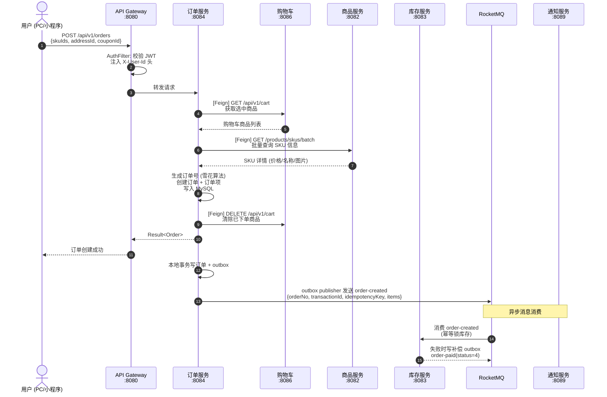
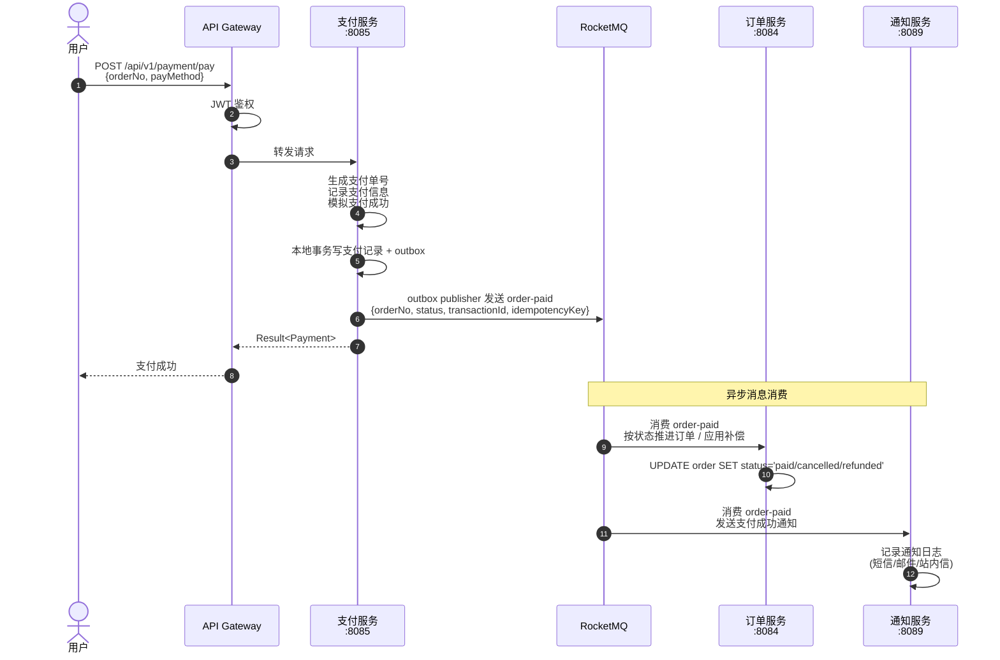
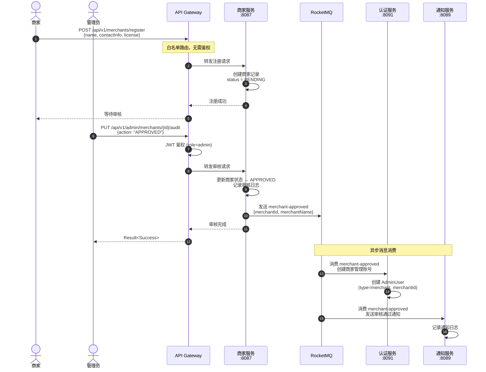
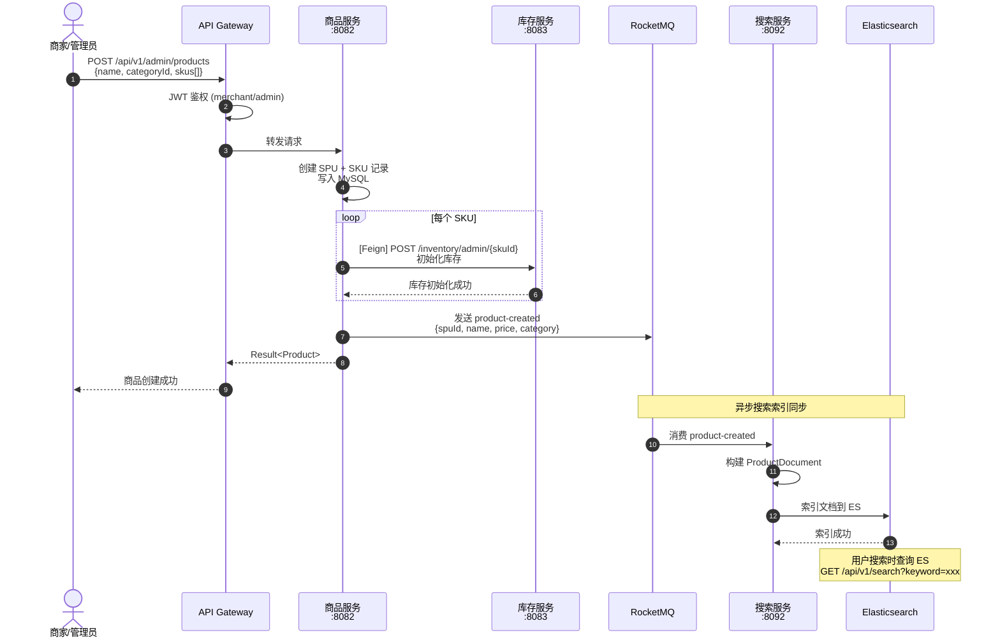
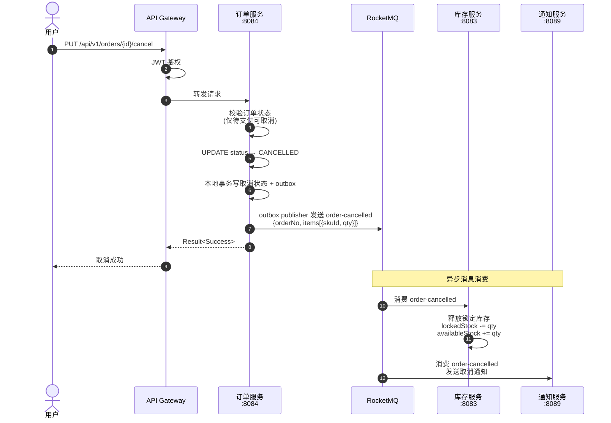
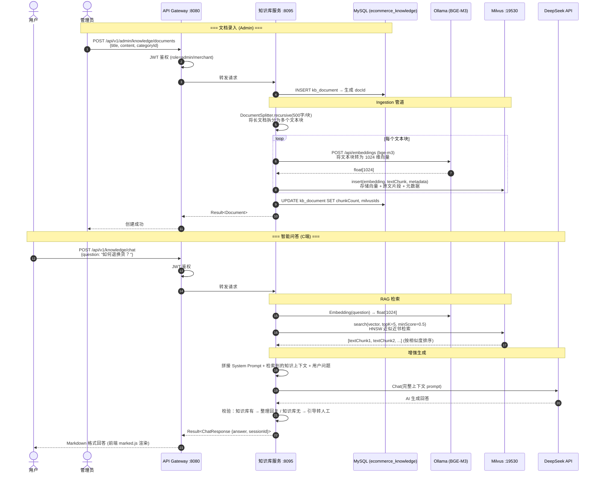

# E-Commerce Platform

基于 `Spring Boot 4 + Spring Cloud` 的微服务电商平台，包含：

- PC Web 商城（Nuxt 3）
- Admin 管理后台（Vue 3 + Element Plus）
- 微信小程序（uni-app）
- AI 知识库 / 智能客服模块（`ecommerce-knowledge`）

当前仓库不仅包含传统电商链路，也已经接入了 `Ollama + Milvus + DeepSeek + LangChain4j`，支持平台知识库、商家私有知识库，以及面向 C 端用户的智能客服问答。

## 项目亮点

- 完整的微服务拆分：认证、用户、商品、库存、订单、支付、购物车、商家、优惠券、通知、文件、搜索、秒杀、监控
- 三端并行：PC Web、管理后台、微信小程序
- API Gateway + JWT + RBAC 权限体系
- RocketMQ 异步事件链路
- Elasticsearch 商品搜索
- MinIO 文件存储
- Spring Boot Admin + Druid 监控
- AI 知识库模块支持：
  - 平台知识库
  - 商家私有知识库
  - 文档向量化与重建索引
  - RAG 问答
  - 联动订单、购物车、优惠券、地址、通知、支付等实时业务数据

## 技术栈

### 后端主工程

| 技术 | 版本 | 说明 |
|---|---|---|
| Java | 21 | 运行时 |
| Spring Boot | 4.0.0 | 主工程基础框架 |
| Spring Cloud | 2025.1.1 | 微服务治理 |
| Spring Cloud Alibaba Nacos | 2025.1.0.0 / 2.4.0 | 注册中心与配置中心 |
| MyBatis-Plus | 3.5.16 | ORM |
| MySQL | 8.0.33 / 8.0 | 关系型数据库 |
| Redis | 7.2 | 缓存 |
| RocketMQ | 5.2.0 / 2.3.0 | 消息队列 |
| Elasticsearch | 7.17.28 / 8.16.0 | 商品搜索 |
| MinIO | latest / 8.6.0 | 对象存储 |
| Druid | 1.2.28 | 数据源与 SQL 监控 |
| JJWT | 0.12.6 | JWT |
| Spring Boot Admin | 4.0.4 | 服务监控 |

### AI 知识库模块（`ecommerce-knowledge`）

> `ecommerce-knowledge` 已经并入根工程，和其他服务一起受父 `pom.xml` 统一管理。

| 技术 | 版本 | 说明 |
|---|---|---|
| Spring Boot | 4.0.0 | 知识库服务基础框架 |
| Spring Cloud | 2025.1.1 | 微服务能力 |
| LangChain4j | 1.14.1 | RAG 与 Agent 编排 |
| Milvus | 2.4.0 | 向量数据库 |
| Ollama | latest | 本地 Embedding 服务 |
| BGE-M3 | latest | Embedding 模型，默认 `1024` 维 |
| DeepSeek Chat | `deepseek-chat` | LLM 对话模型 |

### 前端

| 端 | 技术栈 |
|---|---|
| PC Web | Nuxt 3、Vue 3、Pinia、Tailwind CSS、marked |
| Admin | Vue 3、Vite、Element Plus、Pinia、Axios |
| 微信小程序 | uni-app（Vue 3 模式） |

### 测试

| 技术 | 说明 |
|---|---|
| Playwright | Web E2E |
| H2 | Java 单测数据库 |
| miniprogram-automator | 小程序自动化测试 |

## 项目结构

```text
ecommerce-platform/
├── ecommerce-common/          # 公共模块
├── ecommerce-gateway/         # API 网关 :8080
├── ecommerce-auth/            # 认证服务 :8091
├── ecommerce-user/            # 用户服务 :8081
├── ecommerce-product/         # 商品服务 :8082
├── ecommerce-inventory/       # 库存服务 :8083
├── ecommerce-order/           # 订单服务 :8084
├── ecommerce-payment/         # 支付服务 :8085
├── ecommerce-cart/            # 购物车服务 :8086
├── ecommerce-merchant/        # 商家服务 :8087
├── ecommerce-coupon/          # 优惠券服务 :8088
├── ecommerce-notification/    # 通知服务 :8089
├── ecommerce-file/            # 文件服务 :8090
├── ecommerce-search/          # 搜索服务 :8092
├── ecommerce-seckill/         # 秒杀服务 :8093
├── ecommerce-monitor/         # Spring Boot Admin :8094
├── ecommerce-knowledge/       # AI 知识库服务 :8095
├── ecommerce-web/             # PC Web :3000
├── ecommerce-admin/           # Admin 后台 :5173
├── ecommerce-miniprogram/     # 微信小程序
├── docs/
│   └── init.sql              # 主工程库表与测试数据
├── scripts/
│   ├── start-middleware.sh   # macOS / Linux 中间件启动脚本
│   └── start-middleware.ps1  # Windows PowerShell 中间件启动脚本
└── docker-compose.yml         # MySQL / Redis / Nacos / RocketMQ / ES / MinIO / Milvus
```

## 系统架构图

```mermaid
graph TB
    subgraph Clients["客户端"]
        Web["🖥 PC Web<br/>(Nuxt 3 :3000)"]
        Admin["🔧 管理后台<br/>(Vue 3 + Element Plus :5173)"]
        MP["📱 微信小程序<br/>(uni-app)"]
    end

    subgraph Gateway["API 网关层"]
        GW["Spring Cloud Gateway :8080<br/>AuthFilter (JWT 鉴权 / RBAC)"]
    end

    subgraph Services["微服务层 (Spring Boot 4.0 + Spring Cloud)"]
        direction TB
        subgraph Core["核心业务"]
            AUTH["认证服务<br/>:8091<br/>登录/注册/RBAC"]
            USER["用户服务<br/>:8081<br/>地址管理"]
            PRODUCT["商品服务<br/>:8082<br/>SPU/SKU/分类/品牌"]
            INVENTORY["库存服务<br/>:8083<br/>库存扣减/释放"]
            ORDER["订单服务<br/>:8084<br/>下单/取消/发货"]
            PAYMENT["支付服务<br/>:8085<br/>支付/退款/对账/结算"]
        end
        subgraph Biz["商业支撑"]
            CART["购物车<br/>:8086<br/>Redis 存储"]
            MERCHANT["商家服务<br/>:8087<br/>入驻/审核"]
            COUPON["优惠券<br/>:8088<br/>模板/领取/核销"]
            SECKILL["秒杀服务<br/>:8093<br/>Redis Lua 原子扣减"]
        end
        subgraph Support["基础支撑"]
            SEARCH["搜索服务<br/>:8092<br/>Elasticsearch"]
            NOTIFY["通知服务<br/>:8089<br/>短信/邮件/站内信"]
            FILE["文件服务<br/>:8090<br/>MinIO 存储"]
            KNOWLEDGE["AI知识库<br/>:8095<br/>RAG + Agent"]
            MONITOR["监控中心<br/>:8094<br/>Spring Boot Admin"]
        end
    end

    subgraph Infra["基础设施层 (Docker Compose)"]
        MYSQL["MySQL 8.0<br/>:3306<br/>12个业务数据库"]
        MILVUS["Milvus 2.4.0<br/>:19530<br/>向量数据库"]
        REDIS["Redis 7.2<br/>:6379<br/>购物车/秒杀缓存"]
        NACOS["Nacos 2.4.0<br/>:8848<br/>服务注册与发现"]
        MQ["RocketMQ 5.2.0<br/>:9876<br/>异步消息"]
        ES["Elasticsearch 7.17<br/>:9200<br/>商品搜索"]
        MINIO["MinIO<br/>:9000<br/>对象存储"]
    end

    Web --> GW
    Admin --> GW
    MP --> GW

    GW --> AUTH
    GW --> USER
    GW --> PRODUCT
    GW --> INVENTORY
    GW --> ORDER
    GW --> PAYMENT
    GW --> CART
    GW --> MERCHANT
    GW --> COUPON
    GW --> SECKILL
    GW --> SEARCH
    GW --> NOTIFY
    GW --> FILE
    GW --> KNOWLEDGE

    AUTH -.->|OpenFeign| MERCHANT
    AUTH -.->|OpenFeign| PRODUCT
    ORDER -.->|OpenFeign| CART
    ORDER -.->|OpenFeign| INVENTORY
    ORDER -.->|OpenFeign| PRODUCT
    PRODUCT -.->|OpenFeign| INVENTORY
    MERCHANT -.->|OpenFeign| AUTH

    ORDER -->|RocketMQ| MQ
    PAYMENT -->|RocketMQ| MQ
    PRODUCT -->|RocketMQ| MQ
    MERCHANT -->|RocketMQ| MQ
    MQ -->|消费| INVENTORY
    MQ -->|消费| NOTIFY
    MQ -->|消费| SEARCH
    MQ -->|消费| AUTH

    AUTH --> MYSQL
    USER --> MYSQL
    PRODUCT --> MYSQL
    INVENTORY --> MYSQL
    ORDER --> MYSQL
    PAYMENT --> MYSQL
    MERCHANT --> MYSQL
    COUPON --> MYSQL
    NOTIFY --> MYSQL
    SECKILL --> MYSQL

    CART --> REDIS
    SECKILL --> REDIS
    SEARCH --> ES
    FILE --> MINIO

    AUTH --> NACOS
    USER --> NACOS
    PRODUCT --> NACOS
    INVENTORY --> NACOS
    ORDER --> NACOS
    PAYMENT --> NACOS
    CART --> NACOS
    MERCHANT --> NACOS
    COUPON --> NACOS
    SECKILL --> NACOS
    SEARCH --> NACOS
    NOTIFY --> NACOS
    FILE --> NACOS

    KNOWLEDGE --> MYSQL
    KNOWLEDGE --> MILVUS
    KNOWLEDGE --> NACOS
    MONITOR -.->|监控所有服务| NACOS

    classDef client fill:#4A90D9,stroke:#2E6BA5,color:#fff,stroke-width:2px
    classDef gateway fill:#F5A623,stroke:#D4891C,color:#fff,stroke-width:2px
    classDef core fill:#7ED321,stroke:#5B9B18,color:#fff,stroke-width:2px
    classDef biz fill:#50E3C2,stroke:#3BB29A,color:#fff,stroke-width:2px
    classDef support fill:#B8E986,stroke:#8BBF5E,color:#333,stroke-width:2px
    classDef infra fill:#9B9B9B,stroke:#6D6D6D,color:#fff,stroke-width:2px

    class Web,Admin,MP client
    class GW gateway
    class AUTH,USER,PRODUCT,INVENTORY,ORDER,PAYMENT core
    class CART,MERCHANT,COUPON,SECKILL biz
    class SEARCH,NOTIFY,FILE,MONITOR support
    class MYSQL,REDIS,NACOS,MQ,ES,MINIO infra
```



### 服务间通信方式

| 通信方式 | 调用方 → 被调用方 | 场景 |
|---|---|---|
| **OpenFeign (同步)** | Order → Cart | 获取购物车选中商品 |
| **OpenFeign (同步)** | Order → Inventory | 库存扣减/释放 |
| **OpenFeign (同步)** | Order → Product | 查询 SKU 信息 |
| **OpenFeign (同步)** | Product → Inventory | 商品创建时初始化库存 |
| **OpenFeign (同步)** | Auth → Merchant | Dashboard 统计商家数 |
| **OpenFeign (同步)** | Auth → Product | Dashboard 统计商品数 |
| **OpenFeign (同步)** | Merchant → Auth | 审核通过后创建管理账号 |
| **RocketMQ + Outbox (异步)** | Order → Inventory | `order-created` 库存锁定，消息携带事务 ID / 幂等键 |
| **RocketMQ + Outbox (异步)** | Order → Inventory | `order-cancelled` 库存释放 |
| **RocketMQ + Outbox (异步)** | Inventory → Order | `order-paid(status=4)` 库存补偿回滚订单 |
| **RocketMQ + Outbox (异步)** | Payment → Order | `order-paid` 订单状态更新 / 退款状态回写 |
| **RocketMQ + Outbox (异步)** | Payment → Notification | `order-paid` 支付成功通知 |
| **RocketMQ (异步)** | Product → Search | `product-created` ES 索引同步 |
| **RocketMQ (异步)** | Merchant → Auth | `merchant-approved` 创建商家管理账号 |
| **RocketMQ (异步)** | Merchant → Notification | `merchant-approved` 审核通过通知 |

## 核心业务时序图

### 1. 用户下单流程



### 2. 支付流程



### 3. 商家入驻审核流程



### 4. 商品上架与搜索同步



### 5. 订单取消与库存释放



### 6. AI 知识库 RAG 问答流程



## 核心模块说明

| 模块 | 说明 |
|---|---|
| `ecommerce-gateway` | 统一入口，转发到各微服务，做鉴权与 Header 注入 |
| `ecommerce-auth` | 登录、注册、管理员、角色、权限 |
| `ecommerce-product` | SPU / SKU / 类目 / 品牌 / 评论 |
| `ecommerce-inventory` | 库存扣减、释放、查询 |
| `ecommerce-order` | 下单、取消、订单查询 |
| `ecommerce-payment` | 支付、退款、对账、结算 |
| `ecommerce-search` | 商品搜索与 ES 索引同步 |
| `ecommerce-file` | MinIO 文件上传 |
| `ecommerce-monitor` | Spring Boot Admin 监控中心 |
| `ecommerce-knowledge` | 平台知识库、商家知识库、RAG 问答、实时业务工具调用 |

## AI 知识库能力

`ecommerce-knowledge` 当前的运行链路是：

1. 文档写入 MySQL
2. 文档分块
3. 调用本地 `Ollama` 的 `bge-m3` 生成 embedding
4. 写入 `Milvus`
5. 用户提问时先检索向量，再调用 `DeepSeek Chat`
6. 对购物车、订单、优惠券、地址、通知、支付等实时问题，优先调用业务工具拿最新数据

当前默认配置位于 `ecommerce-knowledge/src/main/resources/application.yml`：

- Ollama 地址：`http://localhost:11434`
- Ollama 模型：`bge-m3`
- Milvus：`localhost:19530`
- DeepSeek 模型：`deepseek-chat`

前端已接入的页面：

| 页面 | 地址 | 说明 |
|---|---|---|
| PC 智能客服 | `http://localhost:3000/knowledge` | C 端问答页面 |
| 平台知识库管理 | `http://localhost:5173/knowledge` | 平台侧文档管理 |
| 商家知识库管理 | `http://localhost:5173/merchant/knowledge` | 商家私有知识库管理 |

## 服务端口

### 业务服务

| 服务 | 端口 |
|---|---|
| Gateway | 8080 |
| User | 8081 |
| Product | 8082 |
| Inventory | 8083 |
| Order | 8084 |
| Payment | 8085 |
| Cart | 8086 |
| Merchant | 8087 |
| Coupon | 8088 |
| Notification | 8089 |
| File | 8090 |
| Auth | 8091 |
| Search | 8092 |
| Seckill | 8093 |
| Monitor | 8094 |
| Knowledge | 8095 |

### 前端

| 应用 | 端口 |
|---|---|
| PC Web | 3000 |
| Admin | 5173 |

### 中间件

| 中间件 | 端口 | 默认账号 / 密码 |
|---|---|---|
| MySQL | 3306 | `root / root` |
| Redis | 6379 | 密码 `root` |
| Nacos | 8848 / 9848 | `nacos / nacos` |
| RocketMQ NameServer | 9876 | - |
| RocketMQ Broker | 10911 / 10909 | - |
| MinIO API | 9000 | `minio / minioadmin` |
| MinIO Console | 9001 | `minio / minioadmin` |
| Elasticsearch | 9200 | - |
| Milvus | 19530 / 9091 | - |
| Ollama | 11434 | - |

## 快速开始

### 1. 环境准备

建议先准备以下环境：

- Docker Desktop / Colima / Podman（至少能执行 `docker compose`）
- JDK 21
- Maven 3.9+
- Node.js 22+
- HBuilderX（仅微信小程序需要）
- Ollama（仅 AI 知识库功能需要）
- Python 3（仅导入知识库种子数据时需要）

如果你暂时不使用 AI 知识库，可以先跳过 `Ollama / DeepSeek / ecommerce-knowledge` 相关步骤。

### 2. 启动中间件

#### 方式一：使用项目脚本

macOS / Linux：

```bash
bash scripts/start-middleware.sh
```

Windows PowerShell：

```powershell
.\scripts\start-middleware.ps1
```

脚本会完成这些事情：

- `docker compose up -d`
- 等待 MySQL、Redis、Nacos、RocketMQ、Elasticsearch、MinIO 就绪
- 创建 RocketMQ topics
- 执行 `docs/init.sql`

#### 方式二：手动启动

```bash
docker compose up -d
```

然后初始化主工程数据库：

```bash
docker exec -i ecommerce-mysql mysql -uroot -proot < docs/init.sql
```

> 注意：`docs/init.sql` 不包含知识库库表，`ecommerce_knowledge` 需要单独初始化。

### 3. 安装并启动 Ollama

> `Ollama` 不在本项目的 `docker-compose.yml` 中，知识库模块依赖本机本地运行的 Ollama 服务。

官方文档：

- 官网文档：https://docs.ollama.com/
- Windows：https://docs.ollama.com/windows
- macOS：https://docs.ollama.com/macos
- Linux：https://docs.ollama.com/linux
- `bge-m3` 模型页：https://ollama.com/library/bge-m3

#### Windows

按官方文档安装 Ollama Desktop/Installer，安装完成后确认后台服务已启动。

#### macOS

按官方文档安装 Ollama，启动后保持服务在线。

#### Linux

```bash
curl -fsSL https://ollama.com/install.sh | sh
```

#### 验证 Ollama 是否可用

```bash
ollama --version
```

如果你的系统没有自动拉起 Ollama 服务，再手动启动：

```bash
ollama serve
```

#### 拉取本项目所需模型

```bash
ollama pull bge-m3
```

检查模型是否已经下载：

```bash
ollama list
```

可选：检查本地 API 是否可访问。

```bash
curl http://localhost:11434/api/tags
```

### 4. 初始化知识库数据库

知识库使用独立数据库 `ecommerce_knowledge`，需要单独执行：

```bash
docker exec -i ecommerce-mysql mysql -uroot -proot < ecommerce-knowledge/sql/init.sql
```

### 5. 配置 DeepSeek API Key

`ecommerce-knowledge` 默认通过 DeepSeek 提供对话模型能力。启动前先设置环境变量。

PowerShell：

```powershell
$env:DEEPSEEK_API_KEY="sk-xxxxxx"
```

macOS / Linux：

```bash
export DEEPSEEK_API_KEY="sk-xxxxxx"
```

### 6. 编译并启动后端服务

#### 6.1 编译主工程

```bash
mvn -DskipTests compile
```

#### 6.2 编译知识库模块

```bash
mvn -pl ecommerce-knowledge -am compile
```

> `ecommerce-knowledge` 已纳入根工程模块，可以通过根工程直接编译；如果只想编它自己，使用 `-pl ecommerce-knowledge -am` 即可。

#### 6.3 启动顺序建议

建议顺序：

1. `ecommerce-auth`
2. `ecommerce-user`
3. `ecommerce-product`
4. `ecommerce-inventory`
5. `ecommerce-order`
6. `ecommerce-payment`
7. `ecommerce-cart`
8. `ecommerce-merchant`
9. `ecommerce-coupon`
10. `ecommerce-notification`
11. `ecommerce-file`
12. `ecommerce-search`
13. `ecommerce-seckill`
14. `ecommerce-monitor`
15. `ecommerce-knowledge`
16. `ecommerce-gateway`

各模块都可以用同样方式启动：

```bash
cd <module>
mvn spring-boot:run
```

例如：

```bash
cd ecommerce-auth && mvn spring-boot:run
cd ecommerce-product && mvn spring-boot:run
cd ecommerce-gateway && mvn spring-boot:run
```

知识库模块启动方式：

```bash
mvn -pl ecommerce-knowledge spring-boot:run
```

### 7. 启动前端

#### PC Web

```bash
cd ecommerce-web
npm install
npm run dev
```

#### Admin 后台

```bash
cd ecommerce-admin
npm install
npm run dev
```

### 8. 启动微信小程序

使用 HBuilderX 打开 `ecommerce-miniprogram`，配置 `manifest.json` 中的小程序信息后运行。

### 9. 可选：导入知识库种子数据

在 `ecommerce-knowledge` 已经启动后，可以执行：

```bash
python ecommerce-knowledge/sql/seed_data.py
```

这个脚本会通过 `http://localhost:8095` 向知识库服务写入示例文档。

### 10. 访问地址

| 页面 / 服务 | 地址 |
|---|---|
| PC Web | http://localhost:3000 |
| PC 智能客服 | http://localhost:3000/knowledge |
| Admin 后台 | http://localhost:5173 |
| 平台知识库管理 | http://localhost:5173/knowledge |
| 商家知识库管理 | http://localhost:5173/merchant/knowledge |
| API Gateway | http://localhost:8080 |
| Nacos | http://localhost:8848/nacos |
| MinIO Console | http://localhost:9001 |
| Elasticsearch | http://localhost:9200 |
| Spring Boot Admin | http://localhost:8094/admin |
| Druid | `http://localhost:{服务端口}/druid/sql.html` |

## 默认账号

主工程初始化脚本 `docs/init.sql` 默认写入：

| 角色 | 账号 | 密码 |
|---|---|---|
| 超级管理员 | `admin` | `admin123` |
| 测试用户 | `testuser` | `test123` |

## RocketMQ Topics

项目默认初始化以下 topics：

| Topic | 队列数 | 说明 |
|---|---|---|
| `order-created` | 4 | 订单创建 |
| `order-cancelled` | 4 | 订单取消 |
| `order-paid` | 4 | 支付成功 |
| `product-created` | 4 | 商品创建后同步搜索索引 |
| `merchant-approved` | 4 | 商家审核通过后创建账号 / 发送通知 |

## 分布式事务现状

当前订单链路采用 `Saga + Transactional Outbox`，并且已经完成这条主流程的代码落地与本地验证：

1. `order` 本地事务写订单和 `order-created` outbox。
2. `inventory` 消费 `order-created`，在同一个本地事务内完成库存处理、事件状态更新，以及库存不足时的补偿 outbox。
3. `payment` 本地事务写支付记录和 `order-paid` outbox。
4. `order` 消费 `order-paid`，推进订单状态，或在 `status=4` 时应用库存补偿。

已经验证通过的范围：

- 正常下单 -> 库存锁定 -> 支付 -> 订单已支付。
- 库存不足 -> `inventory` 补偿消息 -> 订单取消。
- 同一订单并发支付时，只落 1 条支付记录、1 条 `order-paid` outbox，其余请求返回“已支付”。

关键落地约束：

- `payment.order_no` 需要唯一索引 `uk_payment_order_no`，对应脚本见 `docs/sql/migrations/2026-05-29-payment-order-unique.sql`。
- 旧环境如果已经存在重复 `order_no` 的支付脏数据，需要先清理，再执行唯一索引 DDL。

建议保留的验收观察点：

- `GET /api/v1/admin/orders/outbox?aggregateId={orderNo}`
- `GET /api/v1/admin/inventory/events?orderNo={orderNo}`
- `GET /api/v1/admin/payment/outbox?aggregateId={orderNo}`
- `GET /api/v1/orders/no/{orderNo}`

当前还没有覆盖到的故障注入范围：

- 服务重启中的恢复行为
- broker 故障后的自动重试与堆积恢复
- 更大规模的乱序消息和长期积压

## 常见问题

### 1. 知识库服务报错，连不上 `localhost:11434`

说明本机 Ollama 没启动。

处理方式：

```bash
ollama serve
```

如果是 Windows / macOS 图形安装版，确认 Ollama 桌面程序仍在后台运行。

### 2. `model 'bge-m3' not found`

说明模型还没拉下来：

```bash
ollama pull bge-m3
```

### 3. `DEEPSEEK_API_KEY` 未配置

知识库模块会在调用对话模型时失败。先设置环境变量，再启动 `ecommerce-knowledge`。

### 4. 执行了 `docs/init.sql` 但知识库还是起不来

因为 `docs/init.sql` 不包含知识库库表。必须再执行一次：

```bash
docker exec -i ecommerce-mysql mysql -uroot -proot < ecommerce-knowledge/sql/init.sql
```

### 5. `ecommerce-knowledge` 如何单独编译或启动

它已经在根 `pom.xml` 的 `<modules>` 里，由父 POM 统一管理。

常用命令：

```bash
mvn -pl ecommerce-knowledge -am compile
mvn -pl ecommerce-knowledge spring-boot:run
```

### 6. 知识库页面返回 401 / 403

说明当前接口需要登录态或管理员权限：

- `/knowledge`：需要管理员登录
- `/merchant/knowledge`：需要商家管理员登录
- `/api/v1/knowledge/chat`：需要普通用户登录后使用

## 补充说明

- 中间件脚本已经包含 `Milvus`，所以你只需要额外处理 `Ollama`
- `Ollama` 在本项目中负责 embedding，不负责大模型对话
- 当前对话模型默认走 `DeepSeek Chat`
- 如果你要替换 `Ollama` 地址、模型名或 `DeepSeek` 模型名，可以修改 `ecommerce-knowledge/src/main/resources/application.yml`
