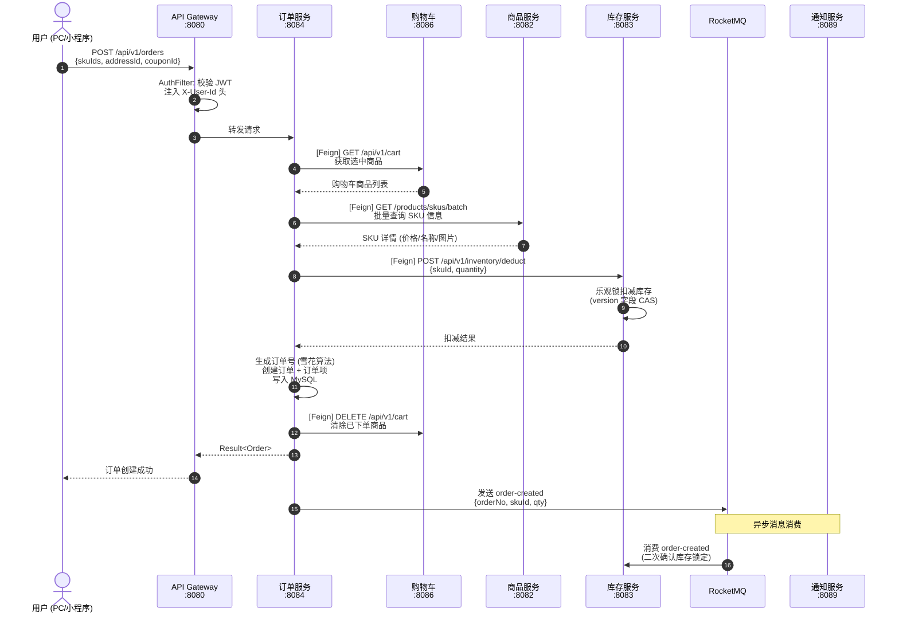
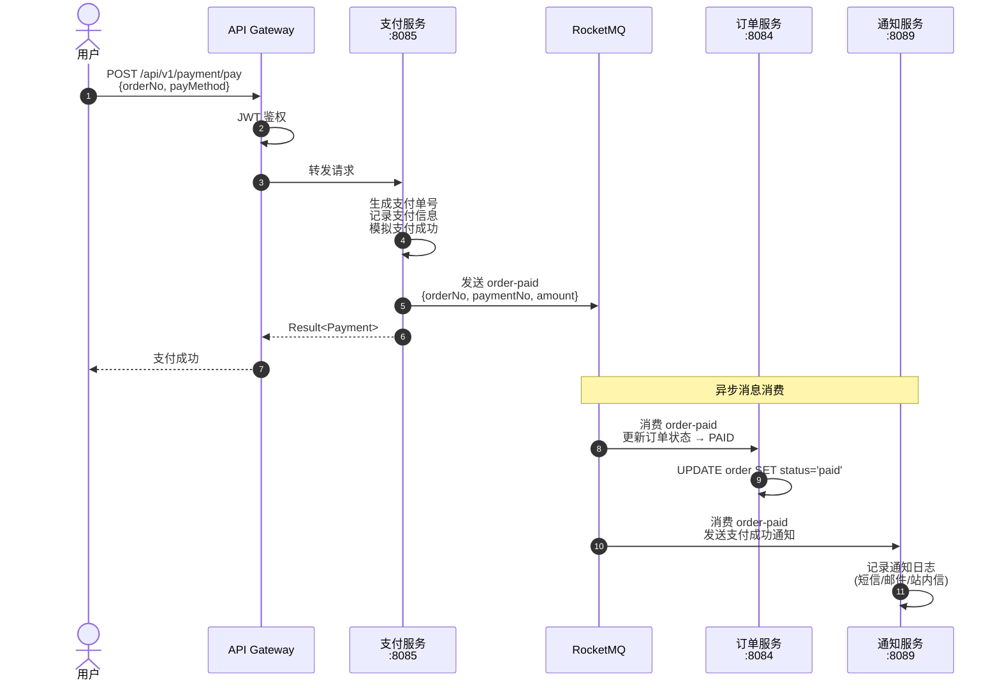
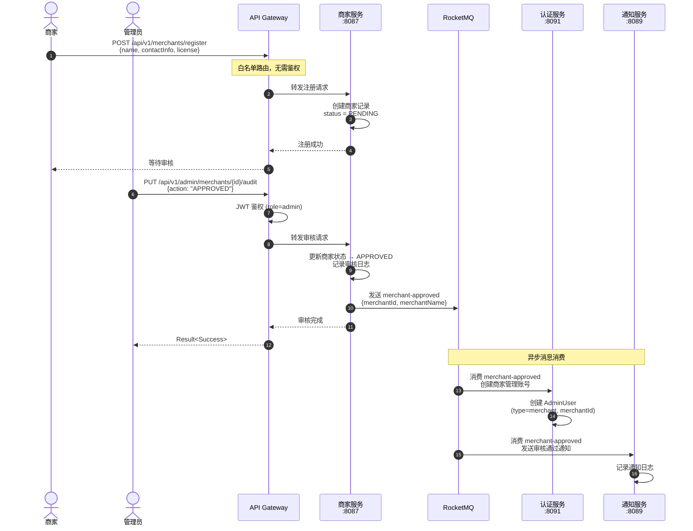
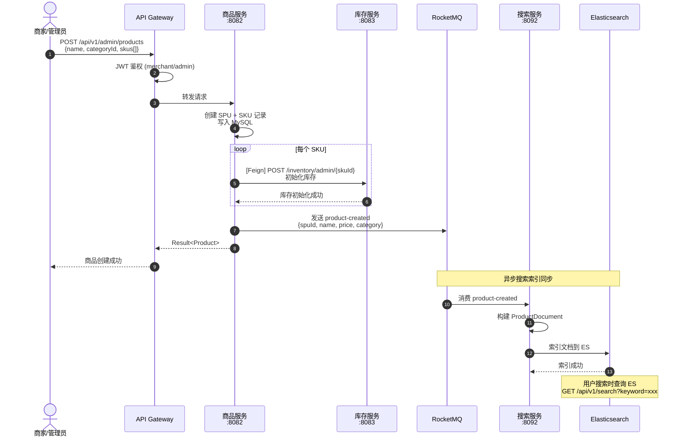
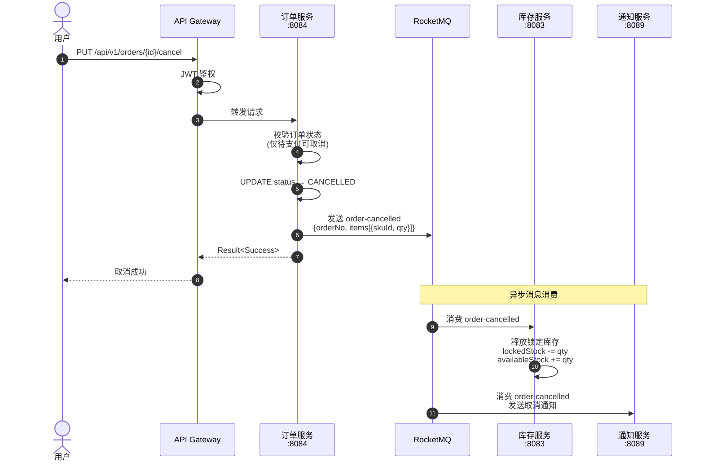
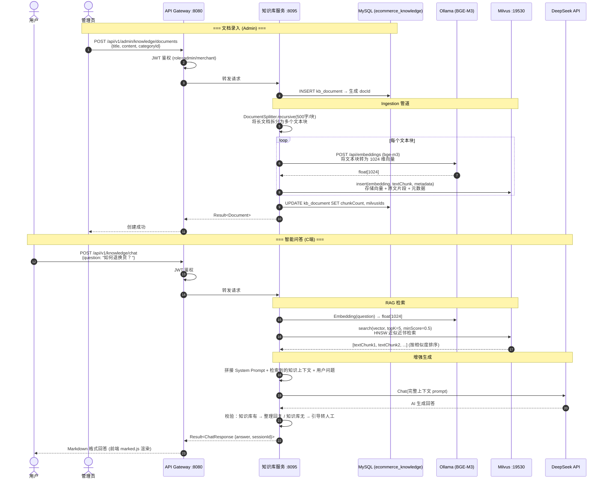

# E-Commerce Platform

微服务电商平台，前后端分离 + 微信小程序，Spring Boot 4.0 + Spring Cloud + Vue 3 + uni-app。

## 技术栈

### 后端

| 技术 | 版本 | 说明 |
|------|------|------|
| Java | 21 | 运行环境 |
| Spring Boot | 4.0.0 | 微服务框架 |
| Spring Cloud | 2025.1.1 | 服务治理 (Gateway / OpenFeign / LoadBalancer) |
| Spring Cloud Alibaba Nacos | 2025.1.0.0 (client) / 2.4.0 (server) | 注册中心 & 配置中心 |
| MyBatis-Plus | 3.5.16 | ORM |
| MySQL | 8.0.33 (driver) / 8.0 (server) | 关系型数据库 |
| Druid | 1.2.28 | 数据库连接池 + SQL 监控 |
| Redis | 7.2 | 缓存 (Lettuce 驱动) |
| RocketMQ | 5.2.0 (server) / 2.3.0 (starter) | 消息队列 |
| Elasticsearch | 7.17.28 (server) / 8.16.0 (client) | 搜索引擎 |
| MinIO | latest (server) / 8.6.0 (SDK) | 对象存储 |
| JJWT | 0.12.6 | JWT 认证 |
| Hutool | 5.8.44 | 工具库 |
| Lombok | 1.18.46 | 代码简化 |
| Spring Boot Admin | 4.0.4 | 集中监控 |
| LangChain4j | 1.14.1 | AI 编排框架 (RAG + Agent) |
| Milvus | 2.4.0 | 向量数据库 (知识库检索) |
| Ollama | latest (bge-m3) | 本地 Embedding 模型 (1024 维) |
| DeepSeek | deepseek-chat (V3) | LLM 对话模型 |

### 前端 (PC Web)

| 技术 | 版本 | 说明 |
|------|------|------|
| Nuxt 3 | ^3.15.0 | SSR 框架 |
| Vue 3 | ^3.5.0 | 组件框架 |
| Pinia | ^2.2.0 | 状态管理 |
| Tailwind CSS | ^3.4.0 | CSS 框架 |
| vue-router | ^4.4.0 | 路由 |

### 前端 (Admin 管理后台)

| 技术 | 版本 | 说明 |
|------|------|------|
| Vue 3 | ^3.5.32 | 组件框架 |
| Vite | ^8.0.10 | 构建工具 |
| Element Plus | ^2.13.7 | UI 组件库 |
| Pinia | ^3.0.4 | 状态管理 |
| Axios | ^1.16.0 | HTTP 客户端 |
| Sass | ^1.99.0 | CSS 预处理器 |

### 微信小程序

| 技术 | 版本 | 说明 |
|------|------|------|
| uni-app | Vue 3 模式 | 跨端框架 |
| Vue 3 | ^3.4.0 | 组件框架 |
| Sass | ^1.70.0 | CSS 预处理器 |
| HBuilderX | 最新版 | IDE / 构建工具 |

### 测试

| 技术 | 版本 | 说明 |
|------|------|------|
| Playwright | ^1.59.1 | E2E 测试框架 |
| H2 | 2.3.232 | 测试用内存数据库 |
| miniprogram-automator | ^0.12.1 | 小程序自动化测试 |

## 项目结构

```
ecommerce-platform/
├── ecommerce-common/          # 公共模块 (DTO / Result / 工具类)
├── ecommerce-gateway/         # API 网关 (:8080)  WebFlux
├── ecommerce-monitor/         # SBA 监控 (:8094)
├── ecommerce-auth/            # 认证服务 (:8091)
├── ecommerce-user/            # 用户服务 (:8081)
├── ecommerce-product/         # 商品服务 (:8082)
├── ecommerce-inventory/       # 库存服务 (:8083)
├── ecommerce-order/           # 订单服务 (:8084)
├── ecommerce-payment/         # 支付服务 (:8085)
├── ecommerce-cart/            # 购物车 (:8086)
├── ecommerce-merchant/        # 商家服务 (:8087)
├── ecommerce-coupon/          # 优惠券 (:8088)
├── ecommerce-notification/    # 通知服务 (:8089)
├── ecommerce-file/            # 文件服务 (:8090)
├── ecommerce-knowledge/       # AI 知识库 (:8095)  SB 3.5.13
├── ecommerce-search/          # 搜索服务 (:8092)
├── ecommerce-seckill/         # 秒杀服务 (:8093)
├── ecommerce-web/             # PC 前端 (Nuxt 3)  :3000
├── ecommerce-admin/           # 管理后台 (Vite)   :5173
├── ecommerce-miniprogram/     # 微信小程序 (uni-app)
├── docs/
│   └── init.sql               # 完整建库建表 + 测试数据
├── scripts/
│   ├── start-middleware.sh    # Mac/Linux 一键启动脚本
│   └── start-middleware.ps1   # Windows PowerShell 一键启动脚本
└── docker-compose.yml         # 中间件 Docker 编排
```

## 系统架构图

```mermaid
graph TB
    subgraph Clients["客户端"]
        Web["🖥 PC Web<br/>(Nuxt 3 :3000)"]
        Admin["🔧 管理后台<br/>(Vue 3 + Element Plus :5173)"]
        MP["📱 微信小程序<br/>(uni-app)"]
    end

    subgraph Gateway["API 网关层"]
        GW["Spring Cloud Gateway :8080<br/>AuthFilter (JWT 鉴权 / RBAC)"]
    end

    subgraph Services["微服务层 (Spring Boot 4.0 + Spring Cloud)"]
        direction TB
        subgraph Core["核心业务"]
            AUTH["认证服务<br/>:8091<br/>登录/注册/RBAC"]
            USER["用户服务<br/>:8081<br/>地址管理"]
            PRODUCT["商品服务<br/>:8082<br/>SPU/SKU/分类/品牌"]
            INVENTORY["库存服务<br/>:8083<br/>库存扣减/释放"]
            ORDER["订单服务<br/>:8084<br/>下单/取消/发货"]
            PAYMENT["支付服务<br/>:8085<br/>支付/退款/对账/结算"]
        end
        subgraph Biz["商业支撑"]
            CART["购物车<br/>:8086<br/>Redis 存储"]
            MERCHANT["商家服务<br/>:8087<br/>入驻/审核"]
            COUPON["优惠券<br/>:8088<br/>模板/领取/核销"]
            SECKILL["秒杀服务<br/>:8093<br/>Redis Lua 原子扣减"]
        end
        subgraph Support["基础支撑"]
            SEARCH["搜索服务<br/>:8092<br/>Elasticsearch"]
            NOTIFY["通知服务<br/>:8089<br/>短信/邮件/站内信"]
            FILE["文件服务<br/>:8090<br/>MinIO 存储"]
            KNOWLEDGE["AI知识库<br/>:8095<br/>RAG + Agent"]
            MONITOR["监控中心<br/>:8094<br/>Spring Boot Admin"]
        end
    end

    subgraph Infra["基础设施层 (Docker Compose)"]
        MYSQL["MySQL 8.0<br/>:3306<br/>12个业务数据库"]
        MILVUS["Milvus 2.4.0<br/>:19530<br/>向量数据库"]
        REDIS["Redis 7.2<br/>:6379<br/>购物车/秒杀缓存"]
        NACOS["Nacos 2.4.0<br/>:8848<br/>服务注册与发现"]
        MQ["RocketMQ 5.2.0<br/>:9876<br/>异步消息"]
        ES["Elasticsearch 7.17<br/>:9200<br/>商品搜索"]
        MINIO["MinIO<br/>:9000<br/>对象存储"]
    end

    Web --> GW
    Admin --> GW
    MP --> GW

    GW --> AUTH
    GW --> USER
    GW --> PRODUCT
    GW --> INVENTORY
    GW --> ORDER
    GW --> PAYMENT
    GW --> CART
    GW --> MERCHANT
    GW --> COUPON
    GW --> SECKILL
    GW --> SEARCH
    GW --> NOTIFY
    GW --> FILE
    GW --> KNOWLEDGE

    AUTH -.->|OpenFeign| MERCHANT
    AUTH -.->|OpenFeign| PRODUCT
    ORDER -.->|OpenFeign| CART
    ORDER -.->|OpenFeign| INVENTORY
    ORDER -.->|OpenFeign| PRODUCT
    PRODUCT -.->|OpenFeign| INVENTORY
    MERCHANT -.->|OpenFeign| AUTH

    ORDER -->|RocketMQ| MQ
    PAYMENT -->|RocketMQ| MQ
    PRODUCT -->|RocketMQ| MQ
    MERCHANT -->|RocketMQ| MQ
    MQ -->|消费| INVENTORY
    MQ -->|消费| NOTIFY
    MQ -->|消费| SEARCH
    MQ -->|消费| AUTH

    AUTH --> MYSQL
    USER --> MYSQL
    PRODUCT --> MYSQL
    INVENTORY --> MYSQL
    ORDER --> MYSQL
    PAYMENT --> MYSQL
    MERCHANT --> MYSQL
    COUPON --> MYSQL
    NOTIFY --> MYSQL
    SECKILL --> MYSQL

    CART --> REDIS
    SECKILL --> REDIS
    SEARCH --> ES
    FILE --> MINIO

    AUTH --> NACOS
    USER --> NACOS
    PRODUCT --> NACOS
    INVENTORY --> NACOS
    ORDER --> NACOS
    PAYMENT --> NACOS
    CART --> NACOS
    MERCHANT --> NACOS
    COUPON --> NACOS
    SECKILL --> NACOS
    SEARCH --> NACOS
    NOTIFY --> NACOS
    FILE --> NACOS

    KNOWLEDGE --> MYSQL
    KNOWLEDGE --> MILVUS
    KNOWLEDGE --> NACOS
    MONITOR -.->|监控所有服务| NACOS

    classDef client fill:#4A90D9,stroke:#2E6BA5,color:#fff,stroke-width:2px
    classDef gateway fill:#F5A623,stroke:#D4891C,color:#fff,stroke-width:2px
    classDef core fill:#7ED321,stroke:#5B9B18,color:#fff,stroke-width:2px
    classDef biz fill:#50E3C2,stroke:#3BB29A,color:#fff,stroke-width:2px
    classDef support fill:#B8E986,stroke:#8BBF5E,color:#333,stroke-width:2px
    classDef infra fill:#9B9B9B,stroke:#6D6D6D,color:#fff,stroke-width:2px

    class Web,Admin,MP client
    class GW gateway
    class AUTH,USER,PRODUCT,INVENTORY,ORDER,PAYMENT core
    class CART,MERCHANT,COUPON,SECKILL biz
    class SEARCH,NOTIFY,FILE,MONITOR support
    class MYSQL,REDIS,NACOS,MQ,ES,MINIO infra
```



### 服务间通信方式

| 通信方式 | 调用方 → 被调用方 | 场景 |
|---------|-----------------|------|
| **OpenFeign (同步)** | Order → Cart | 获取购物车选中商品 |
| **OpenFeign (同步)** | Order → Inventory | 库存扣减/释放 |
| **OpenFeign (同步)** | Order → Product | 查询 SKU 信息 |
| **OpenFeign (同步)** | Product → Inventory | 商品创建时初始化库存 |
| **OpenFeign (同步)** | Auth → Merchant | Dashboard 统计商家数 |
| **OpenFeign (同步)** | Auth → Product | Dashboard 统计商品数 |
| **OpenFeign (同步)** | Merchant → Auth | 审核通过后创建管理账号 |
| **RocketMQ (异步)** | Order → Inventory | `order-created` 库存锁定 |
| **RocketMQ (异步)** | Order → Inventory | `order-cancelled` 库存释放 |
| **RocketMQ (异步)** | Payment → Order | `order-paid` 订单状态更新 |
| **RocketMQ (异步)** | Payment → Notification | `order-paid` 支付成功通知 |
| **RocketMQ (异步)** | Product → Search | `product-created` ES 索引同步 |
| **RocketMQ (异步)** | Merchant → Auth | `merchant-approved` 创建商家管理账号 |
| **RocketMQ (异步)** | Merchant → Notification | `merchant-approved` 审核通过通知 |

## 核心业务时序图

### 1. 用户下单流程



### 2. 支付流程



### 3. 商家入驻审核流程



### 4. 商品上架与搜索同步



### 5. 订单取消与库存释放



### 6. AI 知识库 RAG 问答流程



**知识库服务技术栈 (独立于主项目)：**
- Spring Boot 3.5.13 + Spring Cloud 2025.0.2（与父 POM SB 4.0 隔离）
- LangChain4j 1.14.1 — AI 编排（RAG + @AiService Agent）
- Milvus 2.4.0 — 向量存储，HNSW 索引，毫秒级检索
- Ollama + BGE-M3 — 本地 Embedding，1024 维，中文优化，零 API 费用
- DeepSeek Chat (V3) — LLM 对话，兼容 OpenAI 协议
- MyBatis-Plus 3.5.16 — 文档元数据管理

**调用链路：**

| 调用方 | 方式 | 被调用方 | 场景 |
|--------|------|---------|------|
| 管理员浏览器 | HTTP → Gateway → Knowledge | Knowledge Controller | 文档 CRUD |
| 用户浏览器 | HTTP → Nuxt Proxy → Gateway → Knowledge | Knowledge ChatController | 智能问答 |
| Knowledge Service | HTTP Client | Ollama (localhost:11434) | 文本向量化 (BGE-M3) |
| Knowledge Service | gRPC | Milvus (localhost:19530) | 向量存储 & HNSW 检索 |
| Knowledge Service | HTTPS | DeepSeek API | LLM 对话生成 |
| Knowledge Service | JDBC | MySQL (ecommerce_knowledge) | 文档/分类/会话持久化 |

**Admin 管理 API：**

| 方法 | 路径 | 说明 |
|------|------|------|
| GET | `/api/v1/admin/knowledge/documents` | 文档分页列表（支持分类/状态筛选） |
| POST | `/api/v1/admin/knowledge/documents` | 创建文档 → 自动向量化入库 |
| PUT | `/api/v1/admin/knowledge/documents/{id}` | 更新文档 → 自动重新向量化 |
| DELETE | `/api/v1/admin/knowledge/documents/{id}` | 删除文档 → 同步清理向量 |
| POST | `/api/v1/admin/knowledge/documents/{id}/reindex` | 手动重新向量化 |
| GET | `/api/v1/admin/knowledge/categories` | 分类列表 |
| POST | `/api/v1/admin/knowledge/categories` | 创建分类 |

**C 端 API：**

| 方法 | 路径 | 说明 |
|------|------|------|
| POST | `/api/v1/knowledge/chat` | 智能问答 `{question, sessionId?}` |

**用户侧实时查询能力：**

- 购物车：是否有商品、商品列表、件数
- 订单：最近订单列表、指定订单详情
- 优惠券：我的优惠券、当前可领取优惠券
- 收货地址：地址列表、默认地址
- 通知：最近通知消息
- 支付状态：按订单号查询当前用户支付状态

这些能力由 `ecommerce-knowledge` 通过业务工具直接联动 `cart / order / coupon / user / notification / payment` 等服务完成。  
对于“我的购物车”“我的订单”“我的优惠券”“我的地址”“我的通知”“我的支付”这类个人数据问题，知识库默认按当前登录用户上下文查询，无需用户再次提供 `userId`。

**前端页面：**

| 页面 | 路径 | 技术栈 |
|------|------|--------|
| Admin 知识库管理 | `/knowledge` | Vue 3 + Element Plus (Warm Gold 主题) |
| PC 智能客服 | `/knowledge` | Nuxt 3 + Tailwind CSS + marked.js (MD 渲染) |

**PC 智能客服页面行为：**

- 登录态下支持用户侧 6 类实时查询：购物车、订单、优惠券、收货地址、通知、支付状态
- 未登录时如果询问个人数据，页面会直接提示先登录
- 用户端页面只展示回答正文，不展示知识库 `sources` 调试信息

## 中间件端口

| 中间件 | 端口 | 账号 / 密码 |
|--------|------|------------|
| MySQL | 3306 | root / root |
| Redis | 6379 | 密码: root |
| Nacos | 8848 (http) / 9848 (gRPC) | nacos / nacos |
| RocketMQ NameServer | 9876 | - |
| RocketMQ Broker | 10911 (remoting) / 10909 (VIP) | - |
| MinIO | 9000 (API) / 9001 (Console) | minio / minioadmin |
| Elasticsearch | 9200 | - |
| Milvus | 19530 (gRPC) / 9091 (metrics) | - |
| Ollama | 11434 | - |

## 快速启动

### 1. 前置条件

- **Docker Desktop** (或 Colima / Podman) — 运行中间件容器
- **JDK 21** — 编译运行后端
- **Maven 3.9+** — 项目构建
- **Node.js 22+** — 前端构建
- **HBuilderX** — 小程序编译 (仅小程序)

### 2. 启动中间件

**macOS / Linux:**
```bash
bash scripts/start-middleware.sh
```

**Windows (PowerShell):**
```powershell
.\scripts\start-middleware.ps1
```

脚本会自动完成：启动 Docker 容器 → 等待服务就绪 → 初始化 RocketMQ Topics → 执行 `docs/init.sql`。

**手动启动（按需）：**
```bash
# 仅启动特定中间件
docker compose up -d mysql redis nacos

# 初始化数据库
docker exec -i ecommerce-mysql mysql -uroot -proot < docs/init.sql

# 初始化 RocketMQ Topics
docker exec ecommerce-rmq-broker ./mqadmin updateTopic \
  -n rocketmq-namesrv:9876 -c DefaultCluster \
  -t order-paid -r 4 -w 4
```

### 3. 启动后端服务

```bash
# 每个模块独立启动
cd ecommerce-auth && mvn spring-boot:run     # :8091
cd ecommerce-product && mvn spring-boot:run  # :8082
# ...

# 或者一条命令编译全部
mvn compile -q
```

建议启动顺序：`common → auth → user → product → inventory → order → payment → gateway → knowledge → 其他`

**知识库服务 (ecommerce-knowledge) 额外依赖：**
```bash
# 1. 启动 Milvus 向量数据库
docker compose up -d milvus

# 2. 启动 Ollama 并下载 BGE-M3 模型
ollama pull bge-m3

# 3. 初始化知识库数据库
docker exec -i ecommerce-mysql mysql -uroot -proot < ecommerce-knowledge/sql/init.sql

# 4. 设置 API Key 环境变量
export DEEPSEEK_API_KEY=sk-xxx

# 5. 编译启动（独立 POM，不参与父项目编译）
cd ecommerce-knowledge
mvn compile
mvn spring-boot:run   # :8095

# 6. (可选) 批量导入种子数据
python ecommerce-knowledge/sql/seed_data.py
```

### 4. 启动前端

```bash
# PC Web (ecommerce-web)
cd ecommerce-web
npm install
npm run dev          # http://localhost:3000

# 管理后台 (ecommerce-admin)
cd ecommerce-admin
npm install
npm run dev          # http://localhost:5173
```

### 5. 微信小程序

在 HBuilderX 中打开 `ecommerce-miniprogram` 目录，配置 `manifest.json` 中的微信 AppID，点击「运行 → 运行到小程序模拟器 → 微信开发者工具」。

### 6. 访问地址

| 页面 | 地址 |
|------|------|
| PC Web | http://localhost:3000 |
| 管理后台 | http://localhost:5173 |
| API 网关 | http://localhost:8080 |
| Nacos 控制台 | http://localhost:8848/nacos |
| MinIO 控制台 | http://localhost:9001 |
| **知识库管理后台** | http://localhost:5173/knowledge |
| **PC 智能客服** | http://localhost:3000/knowledge |
| **Spring Boot Admin** | http://localhost:8094/admin |
| **Druid SQL 监控** | http://localhost:{服务端口}/druid/sql.html |
| Druid 登录 | admin / admin |

## RocketMQ Topics

| Topic | 队列数 | 说明 |
|-------|--------|------|
| `order-created` | 4 | 订单创建 |
| `order-cancelled` | 4 | 订单取消 → 库存释放 |
| `order-paid` | 4 | 支付成功 → 订单状态更新 |
| `product-created` | 4 | 商品创建 → 同步 ES |
| `merchant-approved` | 4 | 商家审核通过 → 创建管理账号 |

## 数据库

### 10 个业务数据库

每个数据服务独享一个数据库：`ecommerce_auth`, `ecommerce_user`, `ecommerce_product`, `ecommerce_inventory`, `ecommerce_merchant`, `ecommerce_order`, `ecommerce_payment`, `ecommerce_coupon`, `ecommerce_notification`, `ecommerce_seckill`, `ecommerce_knowledge`。

### 执行初始化

```bash
docker exec -i ecommerce-mysql mysql -uroot -proot < docs/init.sql
```

`init.sql` 包含：建库、建表、分类/品牌/商品/库存测试数据、RBAC 角色权限、管理员账号 (admin/admin123)、测试用户 (testuser/test123)。

## 监控

### Spring Boot Admin

集中监控所有服务：http://localhost:8094/admin

- 服务健康状态 / 内存 / 线程 / GC
- 日志查看 & 运行时修改日志级别
- 环境变量 / 配置查看
- Wallboard 大屏模式

### Druid SQL 监控

各服务独立监控：http://localhost:{port}/druid/sql.html

- SQL 执行统计 & 慢查询
- 连接池状态
- 登录账号：admin / admin

### Admin 默认账号

| 角色 | 账号 | 密码 |
|------|------|------|
| 超级管理员 | admin | admin123 |
| 测试用户 | testuser | test123 |
